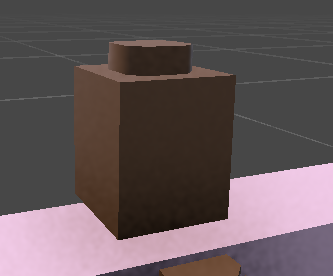
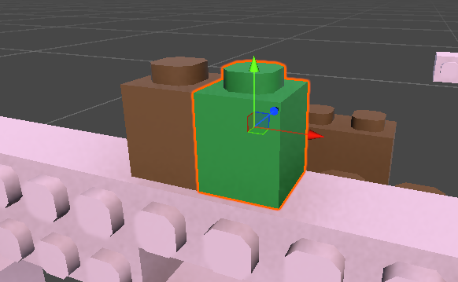

# Brick Assembly Movement Controller — Technisches Anforderungsdokument

- **Dokumentversion:** 0.2 – X/Z-Steuerungsrevision (Achsenbenennung nachträglich auf Y-up-Standard korrigiert, siehe Hinweis unten)
- **Datum:** 17. Juli 2026
- **Zielplattform:** Unity, 3D-Physik, 2.5D-Spielraum
- **Priorität:** Jam-MVP mit klaren Erweiterungspunkten

> Leitidee: Die Figur ist kein einzelner Collider, sondern ein wachsendes, physikalisch gewichtetes Brick-Netzwerk.

> Quelle: `Brick_Movement_Controller_Anforderungsdokument_v0.2_XZ.docx` (vom Nutzer bereitgestellt, aus Downloads übernommen am 2026-07-17).

> **Korrektur (2026-07-17):** Die ursprüngliche v0.2-Fassung hatte einen Dreher im Koordinatenmodell (Sprungachse als +X statt +Y benannt). Die bestehenden Level sind im Unity-Standard gebaut (Y = hoch/runter, X = links/rechts, Z = feste Tiefe). Dieses Dokument wurde durchgängig auf die Standard-Achsen korrigiert: **+Y ist die Sprung-/Gravitationsachse, X ist die horizontale Bewegungsachse, Z ist die gesperrte Tiefenachse** (Kamera blickt entlang Z auf die X/Y-Ebene). Freie Rotation ist entsprechend nur um Z erlaubt.

## 1. Zweck und Scope

Beschreibt die Anforderungen an einen physikbasierten Movement Controller, das Anheften und Abfallen von Bricks, die ausgelagerten Spieler-Stats sowie eine 2.5D-Sidescroller-Kamera. So formuliert, dass ein Unity-Coding-Agent die Systeme in getrennten Komponenten implementieren kann.

> **MVP-Entscheidung:** Alle angehefteten Bricks bilden zusammen genau einen Rigidbody. Die einzelnen Brick-Collider bleiben aktiv, eigene Rigidbodies werden während des Attachments deaktiviert. Dadurch bleibt die Physik in einer Game Jam stabil und reproduzierbar.

### 1.1 Muss-Ziele

- Bewegung ausschließlich auf der Welt-X/Y-Ebene: **+Y ist oben**, X ist links/rechts; Z-Position und X/Y-Rotation sind gesperrt, **Z-Rotation bleibt physikalisch frei**.
- Steuerung: A/D bewegen entlang der X-Achse; Leertaste springt entlang +Y. W/S erzeugen im MVP keine Translation und bleiben für spätere Aktionen reserviert.
- Move Speed, Jump Height, Gravity und Weight/Mass sind als Daten ausgelagert und zur Laufzeit aggregierbar.
- Freie World-Bricks heften sich beim Kontakt an die berührte kardinale Seite eines bereits angehefteten Bricks.
- Bricks dürfen ausschließlich oben, unten, links oder rechts benachbart sein; **keine diagonalen Verbindungen**.
- Gesamtschwerpunkt und Gesamtmasse werden nach jeder Strukturänderung aktualisiert.
- Der Spieler darf springen, sobald irgendein Collider seiner Assembly tragfähigen Boden berührt.
- Beim Verlust eines Bricks fallen automatisch alle Bricks ab, die danach nicht mehr mit dem Main-Brick verbunden sind.
- Die Assembly führt jederzeit die Anzahl/Farben und Stat-Modifikatoren aller verbundenen Bricks.
- Die Kamera folgt weich, erzeugt eine leichte perspektivische Verzögerung und kann am Levelende fest einrasten.

### 1.2 Nicht-Ziele des ersten Meilensteins

- Kein komplexes Gelenk- oder Softbody-System zwischen Bricks.
- Keine diagonalen, halben oder frei gedrehten Attachments.
- Kein vollständiges Upgrade-Balancing; nur das Daten- und Aggregationssystem wird vorbereitet.
- Keine Netzwerk-Synchronisierung oder deterministische Replay-Physik.

## 2. Physik- und Koordinatenmodell

| Thema | Festlegung |
|---|---|
| Spielraum | 3D-Szene mit Bewegung ausschließlich auf X/Y. Z bleibt konstant. |
| Rigidbody | Ein Rigidbody am PlayerRoot für die gesamte Assembly. |
| Constraints | Freeze Position Z; Freeze Rotation X und Y; Rotation Z frei. |
| Bewegungsrichtung | Links/Rechts entlang Welt-X: A = −X, D = +X; unabhängig von der aktuellen Figurrotation. |
| Sprungrichtung | Immer festes World-Up (+Y); Leertaste löst den Sprung aus. |
| Kamera-Blickachse | Kamera blickt grundsätzlich entlang der Z-Achse auf die X/Y-Spielebene. |
| Main-Brick | Ursprung der Assembly, Referenz für Kamera, Grid und Strukturprüfung. |
| Brick-Raster | Jeder Brick belegt eine ganzzahlige Grid-Koordinate in der lokalen X/Y-Ebene: horizontal X, vertikal Y. |
| Kollisionen | Attached Colliders gehören zur PlayerAssembly-Layer; freie Bricks zur WorldBrick-Layer. |

### 2.1 Erwartetes Masseverhalten

Jeder Brick besitzt ein Gewicht. Die Gesamtmasse ist die Summe aller verbundenen Brick-Gewichte. Der lokale Schwerpunkt wird als gewichtetes Mittel der Brick-Zentren berechnet. Ein rechts angefügter schwerer Brick verschiebt den Schwerpunkt in Richtung +X.

```
totalMass = Σ brick.weight
centerOfMassLocal = Σ (brick.localCenter * brick.weight) / totalMass
```

Damit eine einseitige Figur beim Absprung sichtbar kippt, wird der Sprungimpuls nicht am Schwerpunkt, sondern am Weltzentrum des Main-Bricks angesetzt. Liegt der Schwerpunkt rechts davon, entsteht ein physikalisch nachvollziehbares Drehmoment.

```
jumpVelocity = sqrt(2 * gravityMagnitude * finalJumpHeight)
jumpImpulse = Vector3.up * jumpVelocity * totalMass   // +Y ist World-Up
rb.AddForceAtPosition(jumpImpulse, mainBrickWorldCenter, ForceMode.Impulse)
```

> **Wichtig für das Spielgefühl:** Die Zielgeschwindigkeit entlang +Y bleibt trotz wachsender Masse kontrollierbar; die Masse beeinflusst hauptsächlich Impuls, Trägheit, Schwerpunkt und Rotation. Ein zusätzlicher WeightPenalty-Faktor darf später Move/Jump abschwächen, muss aber separat balanciert werden.

## 3. Ausgelagerte Spieler-Stats

Basiswerte liegen in einem `PlayerMovementStats`-ScriptableObject. Die Runtime-Werte werden vom `StatAggregator` aus Basiswerten und allen aktuell verbundenen Brick-Modifikatoren berechnet. Der Controller liest ausschließlich Runtime-Werte.

### 3.1 Pflichtwerte und Startwerte

| Stat | MVP-Default | Bedeutung |
|---|---|---|
| MoveSpeed | 6.5 m/s | Zielgeschwindigkeit für Links/Rechts entlang X. |
| GroundAcceleration | 45 m/s² | Beschleunigung zur Zielgeschwindigkeit. |
| GroundDeceleration | 60 m/s² | Abbremsung ohne Input oder beim Richtungswechsel. |
| AirControl | 0.60 | Multiplikator für Beschleunigung in der Luft. |
| JumpHeight | 2.5 m | Physikalisch gewünschte Sprunghöhe entlang +Y. |
| GravityMagnitude | 28 m/s² | Eigene Gravitation entlang −Y; Rigidbody.useGravity = false. |
| FallGravityMultiplier | 1.55 | Stärkere Gravitation beim Fallen für knackige Landungen. |
| LowJumpGravityMultiplier | 2.0 | Zusätzliche Gravitation, wenn Jump früh losgelassen wird. |
| MaxFallSpeed | 20 m/s | Begrenzt Fallgeschwindigkeit entlang −Y. |
| BaseWeight | 1.0 kg | Gewicht des Main-Bricks. |
| WeightPerStandardBrick | 1.0 kg | Fallback-Gewicht eines normalen Bricks. |
| MaxAngularVelocity | 8 rad/s | Verhindert unkontrollierbares Kreiselverhalten. |
| AngularDrag | 1.4 | Dämpft Rotation, ohne asymmetrische Masse zu verstecken. |
| CoyoteTime | 0.12 s | Sprung kurz nach Verlassen einer Kante. |
| JumpBufferTime | 0.12 s | Früher Tastendruck wird bis zur Landung gespeichert. |
| GroundNormalThreshold | 0.60 | Mindestens dot(contactNormal, +Y) für tragfähigen Boden. |
| AttachCooldown | 0.10 s | Schützt vor mehrfacher Attachment-Auslösung. |

### 3.2 Aggregationsregel

Jeder Brick kann additive und multiplikative Modifikatoren liefern. Reihenfolge ist fest: Basiswert + additive Summe, danach Multiplikatoren, abschließend Min/Max-Clamp.

```
runtimeValue = Clamp((baseValue + Σ additive) * Π multiplicative, minValue, maxValue)
```

- Negative/Downgrade-Bricks verwenden dieselben Stat-IDs, aber negative additive Werte oder Multiplikatoren unter 1.0.
- Weight wird nicht nur als Stat-Modifikator behandelt: Das physische `brick.weight` fließt immer in Masse und Schwerpunkt ein.
- Nach Attach/Detach wird genau einmal `RebuildRuntimeStats()` ausgelöst, nicht in jedem Frame.

## 4. Movement Controller

### 4.1 Input und Update-Reihenfolge

1. Input in `Update` lesen: MoveX aus A/D sowie JumpPressed, JumpHeld und JumpReleased aus der Leertaste.
2. JumpPressed in einem Buffer mit Zeitstempel speichern.
3. In `FixedUpdate` Ground-Kontakte auswerten, Runtime-Stats lesen und Physik anwenden.
4. Strukturänderungen wie Attach/Detach gesammelt am Ende des Physics-Ticks ausführen.
5. Kamera ausschließlich in `LateUpdate` nachführen.

| Taste | Input-Wert | Wirkung |
|---|---|---|
| A | MoveX = −1 | Bewegung nach links entlang −X. |
| D | MoveX = +1 | Bewegung nach rechts entlang +X. |
| Leertaste drücken | JumpPressed | Gepufferter Sprung entlang +Y. |
| Leertaste halten/loslassen | JumpHeld / JumpReleased | Variable Sprunghöhe. |
| W / S | 0 Translation im MVP | Keine Bewegung auf Z oder Y; für spätere Kontextaktionen reserviert. |

> **Achsen-Invariante:** PlayerRoot darf sich nur auf X und Y bewegen. Jede Änderung von Position Z muss verhindert oder auf den konfigurierten PlaneZ-Wert zurückgeführt werden. Physikalische Drehung ist ausschließlich um Z erlaubt.

### 4.2 Horizontale Bewegung

- Der Controller setzt nicht direkt die Transform-Position.
- Ziel ist `desiredVelocityX = inputX × MoveSpeed`; inputX ist −1 für A, 0 ohne Input und +1 für D.
- CurrentVelocityX wird mit GroundAcceleration oder GroundDeceleration in Richtung Zielwert bewegt.
- In der Luft wird die verwendete Beschleunigung mit AirControl multipliziert.
- Y-Geschwindigkeit und Z-Rotation werden durch die seitliche Bewegung nicht überschrieben.
- Die Bewegung darf optional über `AddForceAtPosition` am Main-Brick wirken, damit ein seitlicher Schwerpunkt beim Beschleunigen leicht kippt. Für das MVP ist eine kontrollierte X-Velocity-Annäherung erlaubt.

### 4.3 Sprunglogik

- Ein Sprung ist zulässig, wenn IsGrounded oder CoyoteTime aktiv ist und ein gepufferter JumpPressed vorliegt.
- Vor dem Impuls wird negative Y-Geschwindigkeit auf 0 begrenzt, damit Landungen sofort responsiv sind.
- Der Sprungimpuls wird am Main-Brick-Zentrum angesetzt und zeigt immer entlang +Y.
- Bei frühem Loslassen der Taste wird zusätzliche Gravitation angewendet; dadurch ist die Sprunghöhe variabel.
- Beim Fallen entlang −Y greifen FallGravityMultiplier und MaxFallSpeed.
- Ein neuer Sprung darf von jeder Orientierung der Assembly aus erfolgen; World-Up bleibt konstant +Y.

### 4.4 Ground Detection über die gesamte Assembly

Jeder Collider eines verbundenen Bricks kann Boden melden. Der `PlayerGroundSensor` sammelt alle Collision-Contacts des PlayerRoot und seiner Child-Collider. Ein Kontakt gilt als Boden, wenn seine Normale ausreichend nach oben zeigt.

```
worldUp = Vector3.up  // +Y
isGroundContact = Vector3.Dot(contact.normal, worldUp) >= groundNormalThreshold
```

- Es ist egal, ob Main-Brick, grüner Seiten-Brick, eine Ecke oder eine andere Kante den Boden berührt.
- Reine Wandkontakte zählen nicht als Grounded.
- Grounded bleibt für den aktuellen FixedUpdate-Tick wahr, sobald mindestens ein gültiger Kontakt existiert.
- Optionaler GroundSnap ist nur bei geringer negativer Y-Geschwindigkeit zulässig und darf keine Rotation erzwingen.

## 5. Brick-Attachment-System

### 5.1 Datenmodell der Assembly

| Typ | Verantwortung |
|---|---|
| PlayerAssembly | Verwaltet Grid, Graph, Farben, Gesamtmasse, Schwerpunkt, Attach/Detach und Events. |
| BrickNode | Eindeutige ID, GridPosition, Gewicht, Farbe, Definition und Liste kardinaler Nachbarn. |
| BrickDefinition | ScriptableObject mit Farbe, Materialvariante, Gewicht und Stat-Modifikatoren. |
| MainBrick | Unentfernbarer Root-Knoten an GridPosition (0,0). |
| WorldBrick | Freier Brick mit Collider und Rigidbody, der attachbar oder bereits gelöst sein kann. |

### 5.2 Attachment-Ablauf

1. Kollision zwischen einem Assembly-Collider und einem freien WorldBrick erkennen.
2. Den tatsächlich berührten Assembly-Brick als Receiver bestimmen.
3. Aus Kontakt-Normale, Mittelpunktdifferenz und relativer Geschwindigkeit eine der Richtungen Left/Right/Up/Down bestimmen.
4. Ziel-Gridposition = receiver.GridPosition + cardinalDirection.
5. Attachment verwerfen, wenn die Zielzelle bereits belegt, der Brick nicht attachbar oder der Cooldown aktiv ist.
6. WorldBrick-Rigidbody deaktivieren/entfernen, Brick unter PlayerRoot parenten und exakt auf die Zielzelle snappen.
7. Collider aktiv lassen und auf PlayerAssembly-Layer setzen.
8. Nachbarn zu allen belegten kardinalen Zellen eintragen, nicht nur zum Receiver.
9. Masse, Schwerpunkt, Inertia Tensor, Farben und Runtime-Stats einmal neu aufbauen.
10. `OnBrickAttached`-Event für VFX, Sound und UI auslösen.

### 5.3 Bestimmung der berührten Seite

Die Attachment-Richtung wird im lokalen Rasterraum des PlayerRoot bestimmt. Der dominante Betrag der lokalen Mittelpunktdifferenz entscheidet zwischen horizontal (X) und vertikal (Y). Die lokale Z-Komponente wird ignoriert; Attachments außerhalb der X/Y-Ebene sind unzulässig. Bei fast gleichem Betrag dienen Kontakt-Normale und relative Geschwindigkeit als Tie-Breaker.

```
localDelta = root.InverseTransformPoint(worldBrick.center)
           - root.InverseTransformPoint(receiver.center)
if abs(localDelta.x) >= abs(localDelta.y):
    direction = localDelta.x >= 0 ? Right : Left
else:
    direction = localDelta.y >= 0 ? Up : Down
```

> **Erwartung aus Referenzbild 2:** Läuft der braune Main-Brick von links gegen den grünen Brick, wird der grüne Brick in der Zelle rechts (+X) neben dem berührten braunen Brick eingetragen. Sein Gewicht verschiebt den Schwerpunkt in Richtung +X.

### 5.4 Snap- und Kollisionssicherheit

- Vor dem Snap wird geprüft, ob die Zielzelle frei ist; eine zusätzliche OverlapBox-Prüfung verhindert grobe Überschneidungen mit Level-Geometrie.
- Der freie Brick darf während des Snap-Ticks keine zusätzlichen Collision-Callbacks auslösen.
- Bei Attachment erhält die Assembly keine künstliche Teleport-Korrektur außer der Brick-Position selbst.
- Die bisherige WorldBrick-Geschwindigkeit wird nicht auf die Assembly addiert; optional kann ein kleiner Impact-Impuls als Effekt angewendet werden.

## 6. Brick-Verlust und Strukturzerfall

### 6.1 Regel

Wird ein beliebiger Nicht-Main-Brick entfernt, muss die verbleibende Struktur vom Main-Brick aus geprüft werden. Nur Bricks, die über eine Kette kardinaler Nachbarschaften mit dem Main-Brick verbunden sind, bleiben Teil des Spielers.

### 6.2 Algorithmus

1. Zu entfernenden Brick aus Grid und Nachbarlisten lösen.
2. Breadth-First Search oder Depth-First Search bei Main-Brick starten.
3. Alle erreichbaren Brick-IDs markieren.
4. Jeden nicht erreichbaren Brick als zusätzliches Fragment behandeln.
5. Alle betroffenen Bricks in einem Batch detachen.
6. Erst danach Masse, Schwerpunkt, Farben und Stats einmal neu berechnen.

```
connected = FloodFill(start = mainBrick, adjacency = cardinalNeighbors)
detachSet = allCurrentBricks - connected
```

### 6.3 Verhalten gelöster Bricks

- Parent auflösen, WorldBrick-Layer wiederherstellen und eigenen Rigidbody aktivieren.
- Startgeschwindigkeit = `rb.GetPointVelocity(brickWorldCenter)`, damit Fragmente die Bewegung der Figur glaubwürdig übernehmen.
- Kleinen, konfigurierbaren OutwardImpulse hinzufügen, um sichtbares „Abploppen" zu erzeugen.
- Re-Attachment für eine kurze DetachGraceTime von etwa 0.25 s sperren, damit der Brick nicht sofort wieder anklebt.
- Der Main-Brick darf nicht regulär gelöst werden; ein entsprechender Treffer löst stattdessen PlayerDeath oder wird ignoriert.

## 7. Farb- und Upgrade-Tracking

Die Assembly muss zu jedem Zeitpunkt wissen, welche Farben und Materialvarianten verbunden sind. Das Tracking erfolgt datengetrieben über BrickDefinition und darf nicht über Renderer-Materialnamen erfolgen.

| Runtime-Daten | Beispiel |
|---|---|
| ColorCounts | Green = 2, Red = 1, Blue = 0 |
| MaterialVariantCounts | NormalGreen = 1, CorruptedGreen = 1 |
| ActiveModifiers | MoveSpeed × 1.15; Gravity + 3 |
| TotalWeightByColor | Green = 2.5 kg |
| ConnectedBrickCount | 4 inklusive Main-Brick |

- ColorCounts und Stats werden nur aus der mit dem Main-Brick verbundenen Komponente berechnet.
- Attach/Detach löst `OnAssemblyChanged` sowie `OnRuntimeStatsChanged` aus.
- UI, VFX und Upgrade-Logik abonnieren Events und durchsuchen die Hierarchie nicht selbst.
- Eine dunkle/alternative Materialvariante kann dieselbe BrickColor besitzen, aber negative Modifier liefern.

## 8. 2.5D-Sidescroller-Kamera

### 8.1 Follow-Verhalten

- FollowTarget ist der Main-Brick, nicht der aktuelle Schwerpunkt. Attachments dürfen das Bild nicht abrupt verschieben.
- Kamera bewegt sich in `LateUpdate` mit SmoothDamp oder einer kritisch gedämpften Feder.
- X folgt mit kleiner Dead Zone und horizontalem Look-Ahead abhängig von A/D beziehungsweise der X-Geschwindigkeit.
- Y folgt langsamer und kann innerhalb eines vertikalen Fensters ruhen, um Sprünge entlang +Y lesbar zu halten.
- Der Z-Abstand zur X/Y-Spielebene bleibt grundsätzlich konstant; eine kleine, begrenzte lokale Tiefen- oder Blickreaktion auf Z erzeugt den 3D-Eindruck, ohne Z-Bewegung des Spielers zu erlauben.
- Perspektivkamera ist bevorzugt. Alternativ ist Orthographic mit sichtbarer Leveltiefe möglich.

### 8.2 Vorgeschlagene Kamera-Defaults

| Parameter | Default | Hinweis |
|---|---|---|
| FollowSmoothTimeX | 0.18 s | Horizontal entlang X; direkt, aber nicht starr. |
| FollowSmoothTimeY | 0.28 s | Vertikal entlang Y; etwas träger als X. |
| LookAheadDistance | 1.3 m | Richtung der Bewegung. |
| LookAheadSmoothTime | 0.25 s | Verhindert hektisches Umspringen. |
| HorizontalDeadZone | 0.4 m | Kleine Bewegungen ohne Kameradrift. |
| VerticalDeadZone | 0.7 m | Sprung bleibt zunächst im Bildzentrum. |
| Max3DGive | 0.35 m / 2° | Sehr subtil halten. |
| CameraZOffset | projektspezifisch | Fester Abstand zur X/Y-Spielebene; Tiefe bleibt sichtbar. |

### 8.3 Levelgrenzen und End-Lock

Die Kamera unterstützt CameraBounds mit minX/maxX für links/rechts und minY/maxY für die Höhe sowie einen expliziten CameraLockZone-Trigger am Levelende. Beim Eintritt in die End-Zone wechselt sie in den Zustand LockedAtEnd und hält die definierte Kamera-Position, auch wenn der Spieler anschließend nach links zurückläuft.

| Kamerazustand | Verhalten |
|---|---|
| Following | Normales Smooth-Follow innerhalb der Bounds. |
| Clamped | Follow aktiv, Zielposition wird an Levelgrenzen begrenzt. |
| LockedAtEnd | X/Y/Z und Blickrichtung bleiben am LockAnchor fix; Spieler darf sich im Bild bewegen. |
| Released | Optionaler Rückwechsel aus Lock-Zone für spätere Leveltypen. |

## 9. Empfohlene Unity-Komponenten

| Script / Asset | Kernaufgabe |
|---|---|
| PlayerMovementStats.asset | ScriptableObject mit Basiswerten, Clamps und Feel-Parametern. |
| PlayerRuntimeStats.cs | Unveränderliche/readonly Laufzeitansicht der berechneten Werte. |
| PlayerMovementController.cs | Input-Buffer, horizontale Physik, Gravity, Jump und Fallverhalten. |
| PlayerGroundSensor.cs | Sammelt Contacts aller Assembly-Collider und berechnet IsGrounded. |
| PlayerAssembly.cs | Grid, Graph, Attach/Detach, Farben, Masse, Schwerpunkt und Events. |
| BrickNode.cs | Komponente pro Brick mit ID, GridPosition und Definition. |
| BrickDefinition.asset | Farbe, Variante, Gewicht und StatModifier-Liste. |
| WorldBrick.cs | Freier Zustand, Attach-Sperren und Rigidbody-Umschaltung. |
| StatAggregator.cs | Berechnet Runtime-Stats aus Basiswerten und verbundenen BrickDefinitions. |
| SideScrollerCameraController.cs | Smooth-Follow, Look-Ahead, 3D-Give, Bounds und Lock-State. |
| CameraLockZone.cs | Setzt oder löst einen definierten CameraLockAnchor. |

### 9.1 Player-Prefab-Hierarchie

```
PlayerRoot
├── Rigidbody
├── PlayerMovementController
├── PlayerGroundSensor
├── PlayerAssembly
├── StatAggregator
└── MainBrick  [Grid 0,0]
    ├── BoxCollider
    ├── BrickNode (isMainBrick = true)
    └── Visual / Stud
```

### 9.2 Brick-Prefab-Hierarchie

```
WorldBrick
├── Rigidbody                // nur im freien Zustand aktiv
├── BoxCollider
├── WorldBrick
├── BrickNode
└── Visual / Stud
```

### 9.3 Technische Regeln

- Keine direkte Scene-Suche per `FindObjectOfType` im Gameplay-Loop.
- Keine Stat-Berechnung in `Update`; nur bei AssemblyChanged.
- Keine Transform-Teleports für den PlayerRoot während normaler Bewegung.
- Collider dürfen an Child-Objekten liegen, der einzige aktive Assembly-Rigidbody liegt am Root.
- Physikänderungen erfolgen in `FixedUpdate` oder über eine am Tick-Ende abgearbeitete Command Queue.
- Alle Layer und Tags werden zentral dokumentiert und im Inspector validiert.

## 10. Öffentliche Schnittstellen und Events

```csharp
public interface IPlayerAssembly
{
    BrickNode MainBrick { get; }
    IReadOnlyCollection<BrickNode> ConnectedBricks { get; }
    IReadOnlyDictionary<BrickColor, int> ColorCounts { get; }
    float TotalMass { get; }
    Vector3 LocalCenterOfMass { get; }
    bool TryAttach(WorldBrick brick, BrickNode receiver, ContactPoint contact);
    void Detach(BrickNode brick, DetachReason reason);
}

public event Action<BrickNode> OnBrickAttached;
public event Action<IReadOnlyList<BrickNode>> OnBricksDetached;
public event Action OnAssemblyChanged;
public event Action<PlayerRuntimeStats> OnRuntimeStatsChanged;
```

Die konkreten Namen dürfen an die Projektkonvention angepasst werden. Entscheidend sind klare Zuständigkeiten und dass Movement, Kamera und UI keine eigenen Kopien der Assembly-Logik führen.

## 11. Abnahmekriterien

| ID | Prüfbares Kriterium |
|---|---|
| M-00 | A bewegt ausschließlich entlang −X, D ausschließlich entlang +X und Leertaste springt entlang +Y; W/S erzeugen im MVP keine Translation. |
| M-01 | Ohne angefügte Bricks erreicht der Spieler ungefähr die konfigurierte JumpHeight; Abweichung maximal ±10 %. |
| M-02 | Jump Buffer und Coyote Time sind messbar wirksam und erzeugen keinen Doppelsprung. |
| M-03 | Die Figur kann nach einer Landung auf einem beliebigen verbundenen Brick erneut springen. |
| M-04 | Ein reiner Seitenkontakt mit einer Wand setzt IsGrounded nicht. |
| A-01 | Ein freier Brick wird an genau eine der vier kardinalen Zielzellen angeheftet. |
| A-02 | Belegte Zielzellen führen zu keinem Attachment und keiner Überschreibung. |
| A-03 | Der grüne Brick aus dem Referenzfall landet rechts (+X) am Main-Brick und verschiebt den Schwerpunkt in Richtung +X. |
| A-04 | Nach Attachment bleiben PlayerRoot und Assembly ohne sichtbaren Physik-Sprung stabil. |
| D-01 | Wird ein verbindender Mittel-Brick entfernt, fallen alle vom Main-Brick getrennten Außen-Bricks im selben Tick ab. |
| D-02 | Gelöste Bricks übernehmen plausible Punktgeschwindigkeit und können nach GraceTime wieder aufgenommen werden. |
| S-01 | ColorCounts, Gesamtgewicht und Runtime-Stats entsprechen exakt der verbundenen Komponente. |
| S-02 | Ein verlorener Upgrade-Brick beeinflusst die Stats spätestens im nächsten FixedUpdate nicht mehr. |
| C-01 | Die Kamera folgt weich ohne Zittern durch Rigidbody-Interpolation. |
| C-02 | Attachments verschieben den Follow-Fokus nicht abrupt, weil Main-Brick als Ziel verwendet wird. |
| C-03 | In LockedAtEnd bleibt die Kamera fix, auch wenn der Spieler nach links zurückläuft. |
| P-01 | Z-Drift und Rotation um X/Y treten auch nach starken Kollisionen nicht auf; Rotation um Z bleibt frei. |
| P-02 | Mit mindestens 12 verbundenen Bricks bleibt das System auf Zielhardware spielbar und ohne Joint-Instabilität. |

## 12. Minimale Test-Szenen

| Szene | Aufbau | Erwartung |
|---|---|---|
| T00 Axis Input | Freie Testfläche mit sichtbaren X/Y/Z-Gizmos. | A/D ändern nur X, Leertaste ändert Y; Z bleibt konstant und W/S bewegen nicht. |
| T01 Basic Feel | Ebene Fläche, keine freien Bricks. | Laufen, Coyote, Buffer, kurzer/langer Sprung fühlen sich kontrolliert an. |
| T02 Right Heavy | Ein schwerer Brick rechts (+X) am Main-Brick. | COM in Richtung +X; Sprung entlang +Y am Main-Brick erzeugt sichtbare, begrenzte Z-Rotation. |
| T03 Side Landing | Spieler rotiert und landet auf dem rechten Zusatzbrick. | Grounded wird erkannt; sofortiger gepufferter Sprung funktioniert. |
| T04 Chain Attach | Drei World-Bricks in L-Form erreichbar. | Kardinales Grid entsteht ohne diagonale oder doppelte Belegung. |
| T05 Bridge Break | Main – A – B – C; A wird entfernt. | A, B und C werden als Detach-Batch gelöst. |
| T06 Color Stats | Positive und negative Bricks derselben Farbe. | Counts und Modifier entsprechen nur verbundenen Bricks. |
| T07 Camera End | CameraLockZone am Levelende. | Kamera friert am Anchor ein und folgt beim Zurücklaufen nicht. |
| T08 Stress | 12–20 Bricks, Kollisionen und Detach. | Keine Z-Drift, keine NullRefs, keine instabilen Joint-Ketten. |

## 13. Empfohlene Implementierungsreihenfolge für die Unity-KI

1. PlayerMovementStats und PlayerRuntimeStats anlegen; Main-Brick-Prefab mit Root-Rigidbody und Constraints konfigurieren.
2. Basis-Movement mit Custom Gravity, variablem Jump, Coyote Time und Jump Buffer implementieren.
3. GroundSensor über alle Child-Collider implementieren und Side-Landing testen.
4. PlayerAssembly als Grid/Dictionary mit Main-Brick und einem manuellen Test-Attachment aufbauen.
5. Collision-basiertes TryAttach inklusive Richtungswahl, Snap und belegten Zellen ergänzen.
6. Masse, Schwerpunkt und Sprungimpuls am Main-Brick integrieren; Right-Heavy-Test kalibrieren.
7. Detach + FloodFill + Fragment-Rigidbody implementieren.
8. BrickDefinition, ColorCounts und StatAggregator anbinden.
9. SidescrollerCamera, Bounds und End-Lock ergänzen.
10. Abnahmeszenen durchspielen und erst danach zusätzliche Upgrades/VFX hinzufügen.

> **Jam-Priorität:** Zuerst gutes Laufen und Springen, dann Attachment, danach Zerfall und Kamera. Ein perfekt fühlender Main-Brick mit einem Zusatzbrick ist wertvoller als zehn Upgrades auf einer wackeligen Controller-Basis.

## 14. Definition of Done für diesen Meilenstein

- Alle Muss-Ziele aus Abschnitt 1.1 sind in einer Testszene demonstrierbar.
- Die Startwerte sind im Inspector über ScriptableObjects änderbar, ohne Codeänderung.
- Der Main-Brick bleibt die eindeutige Root-Referenz für Kamera, Grid und Strukturprüfung.
- Bricks attachen kardinal, beeinflussen Masse/Schwerpunkt/Farben/Stats und lösen sich konsistent.
- Jump und Ground Detection funktionieren unabhängig von der aktuellen Z-Rotation und dem berührenden Brick.
- Die Kamera unterstützt normalen Follow, Bounds und einen persistenten End-Lock.
- Console enthält im normalen Testlauf keine Exceptions, wiederkehrenden Warnungen oder Missing References.

## Anhang A – Visuelle Referenzen



Abbildung A1: Main-Brick als 1×1-Wall-Brick mit sichtbarer Noppe.



Abbildung A2: Grüner Brick rechts an der Figur; Grundlage für Schwerpunkt- und Attachment-Test.
